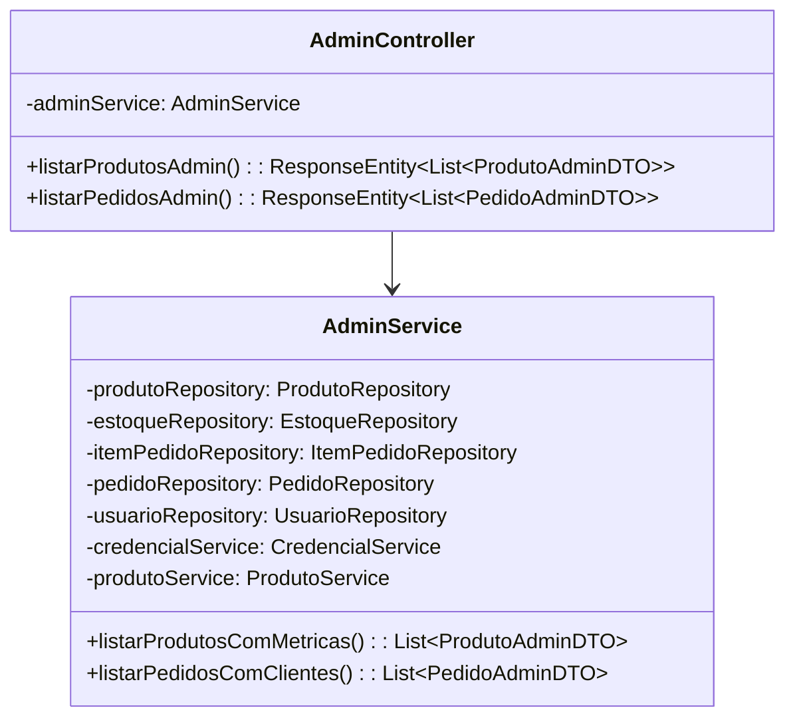
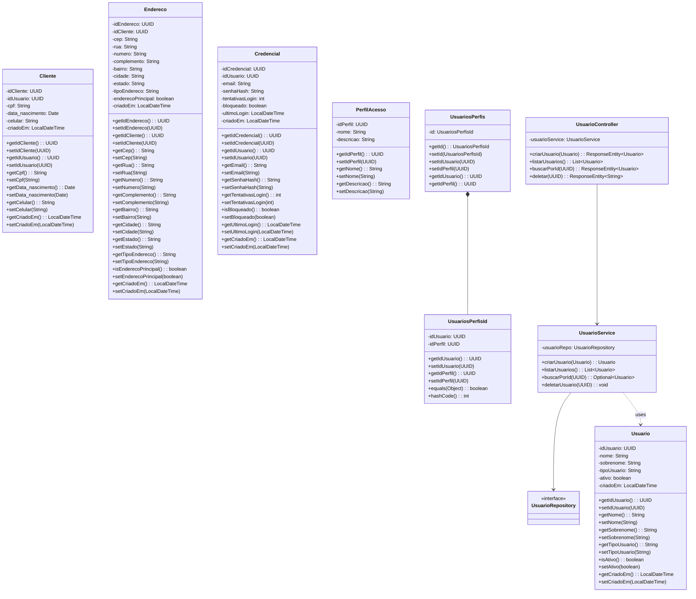
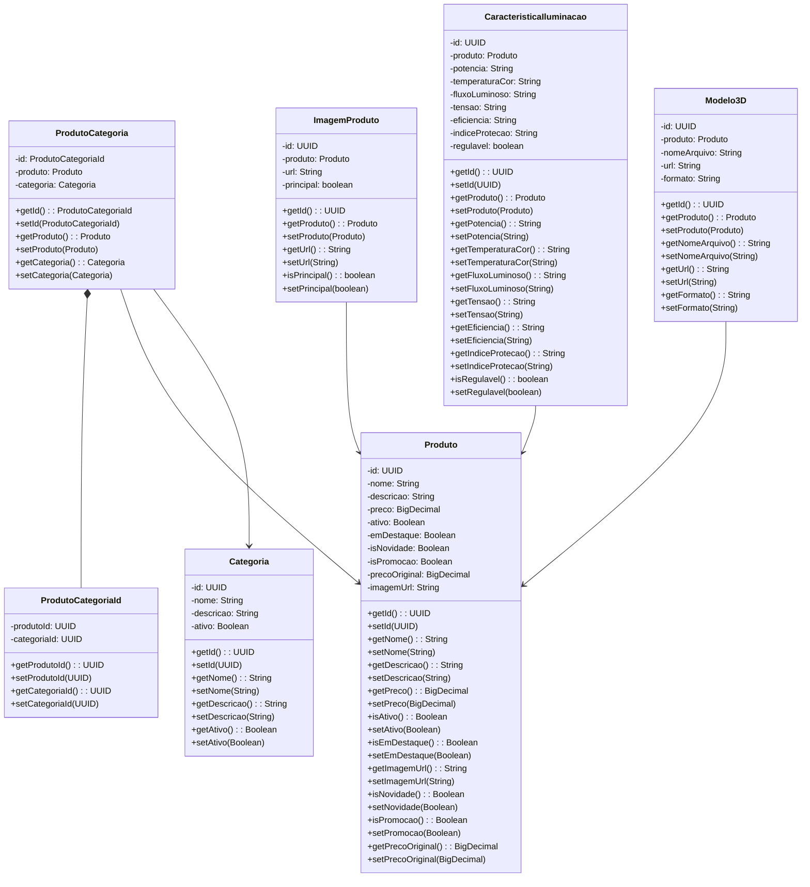
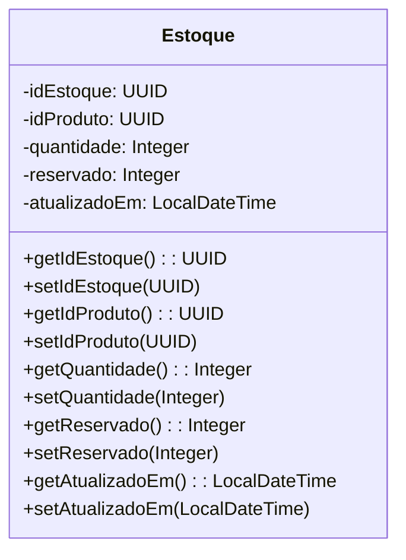
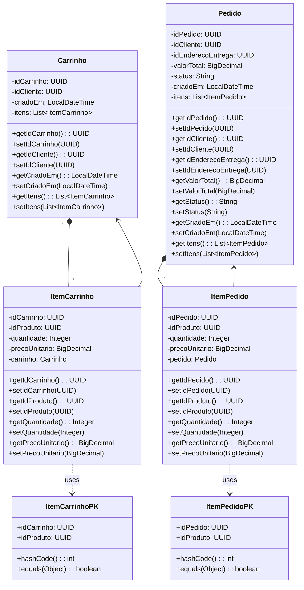

# Diagramas de Classes

Este documento contém os diagramas de classes do projeto RaitoCorp, organizados por módulo.

## Módulo Admin

## Módulo Cadastro

## Módulo Catálogo

## Módulo Estoque

## Módulo Vendas

